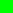
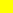

# SUM Parts: Benchmarking Part-Level Semantic Segmentation of Urban Meshes

**CVPR 2025**

[](https://tudelft3d.github.io/SUMParts/)
[](https://youtu.be/CUi1Hf_GSlQ?si=AvghBzWzSCtXCllk)
[](https://arxiv.org/abs/2503.15300)
[](https://huggingface.co/datasets/gwxgrxhyz/SUM-Parts)
[](https://raw.githubusercontent.com/parametric-completion/paco/main/LICENSE)

-----
<div style="max-width: 100%; overflow: hidden; text-align: center;">

</div>

<p style="text-align: justify;">
SUM Parts provides part-level semantic segmentation of urban textured meshes, covering 2.5km² with 21 classes. From left to right: textured mesh, face-based and texture-based annotations. Classes include unclassified
,
terrain
,
high vegetation
,
water
,
car
,
boat
,
wall
,
roof surface
,
facade surface
,
chimney
,
dormer
,
balcony
,
roof installation
,
window
,
door
,
low vegetation
,
impervious surface
,
road
,
road marking
,
cycle lane
,
and sidewalk
.
</p>

## 📊 Benchmark Datasets
Our benchmark datasets include textured meshes and semantic point clouds sampled on mesh surfaces using different methods. The textured meshes are stored in ASCII ply files, while semantic point clouds are stored in binary ply files to save space.

### Semantic textured meshes
The semantic label types of textured meshes are defined in the ply header via `comment label` and `comment texlabel`, while face semantic labels are stored in the ply file as `property int label`. Texture labels are saved in semantic texture mask images named `mask_texturefilename.png` or `full_mask_texturefilename.png`, where the former includes only texture semantic information and the latter adds face semantic information converted to texture semantics. Different colors can be mapped to semantic categories based on header definitions. Below is a ply file header example:  

```
ply
format ascii 1.0
comment TextureFile Tile_+1991_+2695_0.jpg
comment label 0 unclassified
comment label 1 terrain
comment label 2 high_vegetation
comment label 3 facade_surface
comment label 4 water
comment label 5 car
comment label 6 boat
comment label 7 roof_surface
comment label 8 chimney
comment label 9 dormer
comment label 10 balcony
comment label 11 roof_installation
comment label 12 wall
comment texlabel 13 window 100 100 255
comment texlabel 14 door 150 30 60
comment texlabel 15 low_vegetation 200 255 0
comment texlabel 16 impervious_surface 100 150 150
comment texlabel 17 road 200 200 200
comment texlabel 18 road_marking 150 100 150
comment texlabel 19 cycle_lane 255 85 127
comment texlabel 20 sidewalk 255 255 170
element vertex 54890
property float x
property float y
property float z
element face 108322
property list uchar int vertex_indices
property list uchar float texcoord
property float r
property float g
property float b
property float nx
property float ny
property float nz
property int label
property int texnumber
end_header
```
Below are examples of texture mask images. In order: the original texture image, the texture image with semantic pixel labels, and the full-semantic texture image incorporating face semantic information.
<div style="display: flex; gap: 10px;">
  
  
  
</div>

### Semantic colored point clouds
Our point clouds are sampled from mesh surfaces, containing semantic labels, texture colors, geometric positions, and normal vectors. We classify the sampled point clouds into two types: mesh face-sampled point clouds and texture pixel-sampled point clouds.  

For face-sampled point clouds, we evaluated four mesh sampling strategies: face centroid, random, Poisson disk sampling, and our proposed superpixel texture sampling. For pixel labels, we tested three sampling methods: random, Poisson disk, and superpixel texture sampling. The number of random and Poisson disk samples depends on the superpixel texture sampling count, while face centroid sampling matches the number of mesh faces.  

To enable bidirectional semantic information transfer between textured meshes and point clouds:  
- Face centroids correspond to the semantic information of each mesh face.  
- Random and Poisson disk sampling use KNN to find the nearest mesh or texture pixels, transferring semantics via a voting mechanism.  
- Superpixel texture sampling maintains one-to-one correspondence with original texture pixels by preserving superpixel labels (texture pixels can compute their triangular face coordinates via texture coordinates).  

A header example for binary ply point clouds:  
```
ply
format binary_little_endian 1.0
element vertex 362516
property float x
property float y
property float z
property float nx
property float ny
property float nz
property float r
property float g
property float b
property int label
end_header
```

### Visualization
For rendering semantic textured meshes, use the 'Coloring' function in the Surface module of [Mapple](https://github.com/LiangliangNan/Easy3D/releases/tag/v2.6.1):  
- `f:color` displays mesh face colors.  
- `scalar - f:label` shows legend colors for different semantic labels.  
- `h:texcoord` displays texture colors, with corresponding texture images or semantic texture masks selectable via 'Texture'.

<div style="max-width: 100%; overflow: hidden; text-align: center;">

</div>


## 🛠️ Code
### Semantic segmentation
In the `semantic_segmentation` folder, we host deep learning semantic segmentation algorithms for point clouds. For each method described in the paper, we provide input/output interfaces and configuration files for SUM Parts data.  

- **KPConv**: Modified files include `train_UrbanMesh.py` and `UrbanMesh.py`.  
- **PointNeXt_bundle**: Contains PointNet, PointNet++, PointNext, and PointVector. Modified files: `cfgs/sumv2_texture/`, `cfgs/sumv2_triangle/`, `openpoints/dataset/sumv2_triangle/sumv2_triangle.py`, `openpoints/dataset/sumv2_texture/sumv2_texture.py`.  
- **Open3D_ML**: Includes SparseconvUNet and RandLaNet. Modified files: `ml3d/configs/`, `ml3d/datasets/sumv2_texture.py`, `ml3d/datasets/sumv2_triangle.py`.  
- **SPG**: Modified files: `learning/custom_dataset.py`, `learning/main.py`, `partition/partition.py`, `partition/my_visualize.py`.  

Refer to each method's `ReadMe` for compilation and execution.  

For methods like RF_MRF, SUM_RF, and PSSNet, see the `sumv2` branch of the [PSSNet](https://github.com/tudelft3d/PSSNet.git) repository.  

##### Evaluation  
Due to diverse point cloud sampling methods and dual-track (mesh face and texture pixel labels) annotations, evaluation is complex. Currently, please use the built-in ground truth labels in each types of data for initial evaluation. For fine-grained test set evaluation consistent with the paper, send predictions to our email for local assessment. Auto-evaluation code will be added to [Hugging Face](https://huggingface.co/datasets/gwxgrxhyz/SUM-Parts) soon.  


### Interactive annotation
The `interactive_annotation` folder provides code for SAM and SimpleClick, adapted for texture image segmentation with source code modifications. The `Scripts` folder includes scripts for annotation efficiency testing and image processing. For the mesh over-segmentation annotation tool, see [3D_Urban_Mesh_Annotator](https://github.com/tudelft3d/3D_Urban_Mesh_Annotator.git).

## ✏️ Annotation Service
To prevent potential cheating in benchmark evaluations and competitions (later), the annotation tool and source code are temporarily not publicly released. We will make them available later.
The tool is designed for fine-grained annotation of textured meshes. Compared to 2D image or point cloud annotation tools, it is feature-complete but complex to operate, requiring at least 3 hours of professional training for proficiency. We will gradually create help documents and tutorial videos.
For users needing annotation services, we offer paid semantic annotation for textured meshes. Contact us via email for quotation details.

## 📋 TODOs

- [x] Project page, code, and dataset  
- [ ] Evaluation script  
- [ ] Annotation tools, code, and manuals  


## 🎓 Citation

If you use SUM Parts or SUM in a scientific work, please consider citing the following papers:

<a href="https://arxiv.org/abs/2503.15300"></a>
<a href="https://openaccess.thecvf.com/content/CVPR2025/papers/Gao_SUM_Parts_Benchmarking_Part-Level_Semantic_Segmentation_of_Urban_Meshes_CVPR_2025_paper.pdf">[paper]</a>&nbsp;&nbsp;<a href="https://openaccess.thecvf.com/content/CVPR2025/supplemental/Gao_SUM_Parts_Benchmarking_CVPR_2025_supplemental.pdf">[supplemental]</a>&nbsp;&nbsp;<a href="http://arxiv.org/abs/2503.15300">[arxiv]</a>&nbsp;&nbsp;<a href="./CITATION.bib">[bibtex]</a><br>
```bibtex
@InProceedings{Gao_2025_CVPR,
    author    = {Gao, Weixiao and Nan, Liangliang and Ledoux, Hugo},
    title     = {SUM Parts: Benchmarking Part-Level Semantic Segmentation of Urban Meshes},
    booktitle = {Proceedings of the Computer Vision and Pattern Recognition Conference (CVPR)},
    month     = {June},
    year      = {2025},
    pages     = {24474-24484}
}
```
#
<a href="https://arxiv.org/abs/2103.00355"></a>
<a href="https://doi.org/10.1016/j.isprsjprs.2021.07.008">[paper]</a>&nbsp;&nbsp;<a href="https://3d.bk.tudelft.nl/projects/meshannotation/">[project]</a>&nbsp;&nbsp;<a href="https://arxiv.org/abs/2103.00355">[arxiv]</a>&nbsp;&nbsp;<a href="./CITATION.bib">[bibtex]</a><br>
```bibtex
@article{Gao_2021_ISPRS,
    title = {SUM: A benchmark dataset of Semantic Urban Meshes},
    journal = {ISPRS Journal of Photogrammetry and Remote Sensing},
    volume = {179},
    pages = {108-120},
    year = {2021},
    issn = {0924-2716},
    doi = {https://doi.org/10.1016/j.isprsjprs.2021.07.008},
    url = {https://www.sciencedirect.com/science/article/pii/S0924271621001854}
}
```

## ⚖️ License  
SUM Parts (including the software and dataset) is a free resource; you can redistribute it and/or modify it under the terms of the GNU General Public License as published by the Free Software Foundation, either version 3 of the License, or (at your option) any later version. The full text of the license can be found in the accompanying 'License' file.

If you have any questions, comments, or suggestions, please contact me at <i>gaoweixiaocuhk@gmail.com</i>

[<b><i>Weixiao GAO</i></b>](https://3d.bk.tudelft.nl/weixiao/)

Jun. 9, 2025